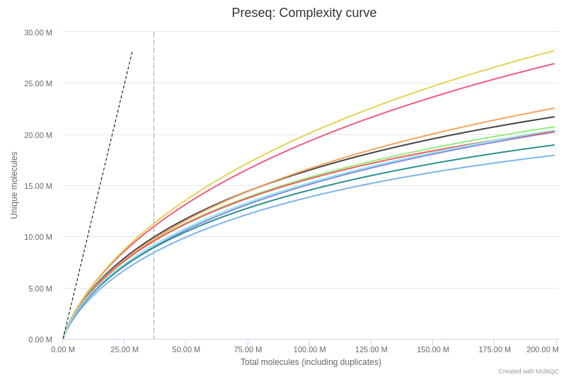
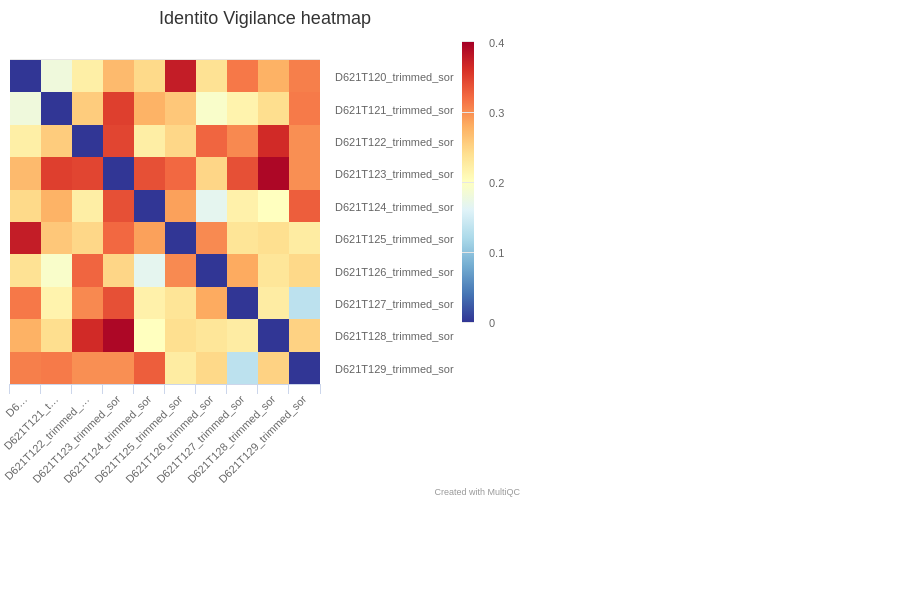

# Output

This document describes the output produced by the pipeline. Most of the plots are taken from the MultiQC report, which summarises results at the end of the pipeline.

## Pipeline overview
The pipeline is built using [Nextflow](https://www.nextflow.io/) and processes RNA-seq from raw sequencing reads to count table for downstream analysis.
Briefly, the overall quality of raw sequencing data is first checked using [FastQC](#fastqc). Reads are then aligned on a [ribosomal RNAs database](#rrna-mapping) and on the [reference genome](#genome-mapping). Additional controls on aligned data are performed to infer [strandness](#strandness), [complexity](#complexity-curves), [gene-based saturation](#gene-based-saturation), [read distribution](#read-distribution) or [duplication level](#dupradar). The aligned data are then used to generate a final [count matrix](#counts) with all genes and all samples. A first-level analysis is run, including the [number of expressed genes](#expressed-number), their [functional classes](#expressed-genes-types) and an exploratory analysis ([correlation](#correlation), [PCA](#pca)). The [identito monitoring](#identito) is also available for Human data.

## FastQC
[FastQC](http://www.bioinformatics.babraham.ac.uk/projects/fastqc/) gives general quality metrics about your reads. It provides information about the quality score distribution across your reads, the per base sequence content (%T/A/G/C). You get information about adapter contamination and other overrepresented sequences.

For further reading and documentation see the [FastQC help](http://www.bioinformatics.babraham.ac.uk/projects/fastqc/Help/).

> **NB:** The FastQC plots displayed in the MultiQC report shows the input reads. In theory, they should be already trimmed for adapter sequence and potentially regions with low quality. 
For details about reads trimming, see the [raw_qc](https://gitlab.curie.fr/data-analysis/raw-qc) pipeline.

**Output directory: `results/fastqc`**

* `[SAMPLE]_fastqc.html`
  * FastQC report, containing quality metrics for your untrimmed raw fastq files
* `zips/[SAMPLE]_fastqc.zip`
  * zip file containing the FastQC report, tab-delimited data file and plot images

## rRNA Mapping
When the annotation are available, the pipeline first aligns the sequencing reads on a database of ribosomal RNA sequence with the bowtie1 software.
This metric is mainly useful for protocols based on rRNA depletion. Samples with a high level of rRNA contamination should be carefully considered.

For detail about the bowtie1 mapper, see the [bowtie help](http://bowtie-bio.sourceforge.net/index.shtml)

> **NB:** Note that the fastq files after rRNA cleaning are exported only if the `--saveAlignedIntermediates` parameter is turn on.

**Output directory: `results/rRNA_mapping`**

* `logs/[SAMPLE].log`
  * Log file of bowtie1 mapping with the number of aligned reads on rRNA sequences
* `[SAMPLE]_norRNA_R{1,2}.fastq.gz`
  * The fastq file after rRNA cleaning

## Strandness

Sequencing orientation is an important information for mapping and/or reads counting.
The current pipeline allows the user to specify the strandness using the `--stranded` parameter.
Note that we decided to use the HTSeqCounts nomenclature with :
- `yes`: stranded protocols
- `reverse`: reverse-stranded protocols
- `no`: unstranded protocols

By default, or if you do not have the information (`--stranded 'auto'`), the pipeline used the RSeQC tool to infer the strandness of the experiment on a subset of reads (200000 by default)
This script predicts the mode of library preparation (sense-stranded or antisense-stranded) according to how aligned reads overlay gene features in the reference genome.
For further detail on the infer experiment tool see the [RSeQC help page](http://rseqc.sourceforge.net/).

**Output directory: `results/strandness`

* `[SAMPLE].txt`
  * RSeQC infer experiment output file
* `[SAMPLE]_strandness.txt`
  * Readable Strandness information

## Genome Mapping

Raw (or rRNA-cleaned) sequencing data are then aligned on the reference genome.
The current version includes the following RNA reads mappers: `STAR`, `HiSat2`.

For details about these mapper, see their help page:
- [`STAR`](https://github.com/alexdobin/STAR) 
- [`hisat2`](http://ccb.jhu.edu/software/hisat2/index.shtml)

> **NB:** Note that the TopHat2 software was included for historical reason, but is now deprecated and replaced by the HiSat2 mapper.

Number of aligned reads (unique and multiple) are then extracted from the aligned (.bam) files.
In practice, we usually observe at least 70% of reads aligned on the reference genome. Samples with lower mapper rate should be carrefully considered and check for contamination, adapter content, sequencing issues, etc.

> **NB:** The final results of the alignment step is a sorted bam file per sample, with its index file (.bai). By default, all other files such as unsorted bam files are not saved.
Use the `--saveAlignedIntermediates` options to save all files.

**Output directory: `results/mapping`**

* `logs/`
  * Log files with mapping statistics
* `[SAMPLE].bam`
  * The final sorted bam file
* `[SAMPLE].bam.bai`
  * The index file of the sorted bam file

## Read Distribution

This tool calculates how mapped reads are distributed over genomic features. A good result for a standard RNA seq experiments is generally to have as many exonic reads as possible (CDS_Exons). A large amount of intronic reads could be indicative of DNA contamination in your sample or some other problem.
See the read_distribution tool from [RSeQC](http://rseqc.sourceforge.net/) for details.

**Output directory: `results/read_distribution`**

* `[SAMPLE].read_distribution.txt`
  * Results file with the number of reads assigned to each annotation.

## Gene Body Coverage

This script calculates the reads coverage across gene bodies. This makes it easy to identify 3' or 5' skew in libraries. A skew towards increased 3' coverage can happen in degraded samples prepared with poly-A selection, or in 3'-seq experiments.

> **NB:** Note that following nfcore recommandation, we subsample the BAM to 1 Million reads. This speeds up this task significantly and has no to little effect on the results.

**Output directory: `results/read_distribution`**

* `[SAMPLE]_rseqc.geneBodyCoverage.curves.pdf`
* `[SAMPLE]_rseqc.geneBodyCoverage.r`
* `[SAMPLE]_rseqc.geneBodyCoverage.txt`

## Complexity Curves

Preseq estimates the complexity of a library, showing how many additional unique reads are sequenced for increasing the total read count. 
A shallow curve indicates that the library has reached complexity saturation and further sequencing would likely not add further unique reads. 
The dashed line shows a perfectly complex library where total reads = unique reads.

> **NB:** Note that these are predictive numbers only, not absolute. The MultiQC plot shows extrpolation until 200 Millions of sequencing reads on the X axis - click and drag from the left side of the plot to zoom in on more realistic numbers.

**Output directory: `results/preseq`**

* `[SAMPLE].extrap_ccurve.txt`
  * Results of complexity extrapolation up to 200 millions reads

## Gene-based Saturation

In addition to library complexity, we use a custom R script to infer the library complexity at the gene level. In this case, the script downsample the libraries and counts how many genes are detected (with at least 1 CPM - counts per million). It therefore gives an overview of the number of detected genes at various sequencing depth.

**Output directory: `results/gene_saturation`**

* `counts.gcurve.txt`
  * Results of downsampling for all samples

## Counts

Several tools can be used to generate a raw counts table showing the number of reads per genes and per samples.
By default, the STAR mapper allows to align and to counts reads per gene. Addition tools such as `featureCounts` or `HTSeqCounts` are still commonly used.
For details about these tools, see the [featureCounts help page](http://bioinf.wehi.edu.au/featureCounts/) or the [HTSeqCounts help page](https://htseq.readthedocs.io/en/release_0.11.1/count.html).

According to the tool used, MultiQC should report the number of reads assigned to a gene features. A high fraction of non assigned reads usually means that many reads do not overlap coding regions.

>**NB:** Counts files are firt generated per sample, and are then merged using a custom R script. At this step, we also generate a TPM (transcript per million)-normalized count table.
The TPM file can be seen as a table of expression values. However, note that this type of normalization is not adviced for downstream analysis such as differential analysis.
For furhter information about TPM calculation, see the [RNAseq blog page](https://www.rna-seqblog.com/rpkm-fpkm-and-tpm-clearly-explained/).

**Output directory: `results/counts`**

* `[SAMPLE]_counts.csv`
  * Individual counts file per sample
* `[SAMPLE].summary`
  * Log file of each tool specifying the number of reads assigned to a feature
* `tablecounts_raw.csv`
  * The raw counts value for all samples and all genes
* `tablecounts_tpm.csv`
  * The TPM normalized value for all samples and all genes

## Expressed Genes Types

We also use a custom R script to count overlaps with different classes of genes. This gives a good idea of where aligned reads are ending up.
Note that only expressed genes (TPM>1) are considered.

**Output directory: `results/read_distribution`**

* `counts_genetype.txt`
  * A single file showing the number of genes classes for all the samples

 

## DupRadar

[DupRadar](https://bioconductor.org/packages/release/bioc/html/dupRadar.html) is a Bioconductor package for R. It plots the duplication rate against expression (RPKM) for every gene. A good sample with little technical duplication will only show high numbers of duplicates for highly expressed genes. Samples with technical duplication will have high duplication for all genes, irrespective of transcription level.
For details about the dupRadar results, see the [help page](https://www.bioconductor.org/packages/devel/bioc/vignettes/dupRadar/inst/doc/dupRadar.html).

>**NB:** Note that dupRadar requires bam file marked for duplicates with `Picard` tool. The markdup files are saved only if the `--saveAlignedIntermediate` option is used.

**Output directory: `results/dupradar`**

* `[SAMPLE]_markDups.bam_duprateExpDens.pdf`
* `[SAMPLE]_markDups.bam_duprateExpBoxplot.pdf`
* `[SAMPLE]_markDups.bam_expressionHist.pdf`
* `[SAMPLE]_markDups.bam_dupMatrix.txt`
* `[SAMPLE]_markDups.bam_duprateExpDensCurve.txt`
* `[SAMPLE]_markDups.bam_intercept_slope.txt`

 

## PCA

We also performed a simple exploratory analysis from the raw count table.
Data are first normalized using a variance stabilization method (see the [Bioconductor good practices](https://www.bioconductor.org/packages/devel/workflows/vignettes/rnaseqGene/inst/doc/rnaseqGene.html) for details), and a principal component analysis is performed on the 1000 most variable genes using the `DESeq2` package.

The MultiQC report shows the reduction dimension on the two first component.

**Output directory: `results/exploratory_analysis`**

* `deseq2_pca_coords_mqc.csv`

## Correlation

From the same VST normalized data, we also calculate a Pearson correlation of all sample pairs.
The results are displayed as an heatmap of correlation values.

**Output directory: `results/exploratory_analysis`**

* `vst_sample_cor_mqc.csv`

## Identito monitoring

In order to check the association between pairs of normal/tumor samples, a list of common SNPs (`--polym`) is used to cluster all the samples.  
The results are displayed as a heatmap with a color code representing the distance (1 - Jaccard) between two samples.

**Output directory: `preprocessing/metrics/identito`** 

* `[SAMPLE].matrix.tsv`
  * results of the SNPs calling for the list of SNPs
* `clustering_plot_identito.csv`
  * distance matrix between each sample
	

## MultiQC

[MultiQC](http://multiqc.info) is a visualisation tool that generates a single HTML report summarising all samples in your project. Most of the pipeline QC results are visualised in the report and further statistics are available in within the report data directory.

The pipeline has special steps which allow the software versions used to be reported in the MultiQC output for future traceability.

**Output directory: `results/multiqc`**

* `rnseq_report.html`
  * MultiQC report - a standalone HTML file that can be viewed in your web browser
* `multiqc_data/`
  * Directory containing parsed statistics from the different tools used in the pipeline

For more information about how to use MultiQC reports, see http://multiqc.info.
See the file 'test-op/multiqc_report.html' for an example on the test dataset.

